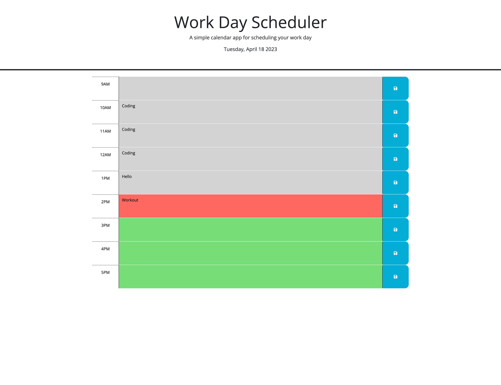

## Business Calendar

# Description

 The average person goes throughout life without keeping a schedule organized with their hour-by-hour activities. This leads to an unproductive day, as many important tasks are left unfinished due to procrastination. By creating a simple calendar application that tracks the hourly activities of a person's typical 9-5 job, one can organize their time more effectively and increase their work output. You will no longer have to carry all of your responsibilities in your mind and guess what comes next. Having made this program, I learned basic principles of localStorage, jQuery, DOM traversal, event delegation, and parts of the DayJS library. 

 # Usage

 1. Click the textarea
 2. Write an event
 3. Click the save button icon to the right
 4. All your events should remain, even after refreshing the page.
 5. To delete an event, click on the textarea, erase the contents, then click the save button and refresh the page.

 The application can be accessed here: https://lyubomirg1995.github.io/business-calendar/

# Credits

1. Dynamically changing textbox colors, lines 17-29: Kathyrn Young (Student), Sean McCarthy (Teacher's Assistant), Joshua Bohde (Instructor ) -- Office Hours, GTP-4 Tutor Prompts (no direct code solutions)
2. Displaying today's time, lines 42-44: https://day.js.org/docs/en/parse/now
3. Saving textarea to localStorage, lines 5-12: GTP-4 Tutor Prompts (no direct code solutions), Kathyrn Young (lines 8-9) -- Office Hours
4. Retrieving + persistence of localStorage information, lines 33-38: AskBCS Learning Assistant, dgaither, GTP-4 Tutor Prompts (no direct code solutions)

